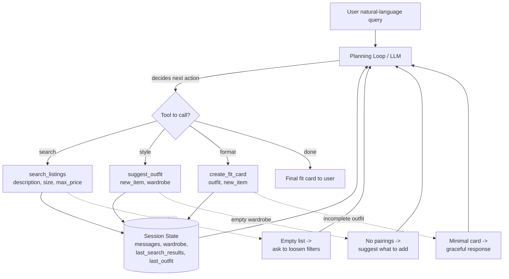

# FitFindr — planning.md

> Complete this document before writing any implementation code.
> Your spec and agent diagram are what you'll use to direct AI tools (Claude, Copilot, etc.) to generate your implementation — the more specific they are, the more useful the generated code will be.
> Your planning.md will be reviewed as part of your submission.
> Update it before starting any stretch features.

---

## Tools

List every tool your agent will use. For each tool, fill in all four fields.
You must have at least 3 tools. The three required tools are listed — add any additional tools below them.

### Tool 1: search_listings

**What it does:**
Searches the 40 mock secondhand listings for pieces that match a free-text
description (keywords are matched against each listing's title, description,
style tags, colors, category, and brand), and optionally filters those matches
by size and a maximum price. Results are scored by how many keywords match and
returned best-first.

**Input parameters:**
- `description` (str): Free-text description of what the user is looking for, e.g. `"vintage graphic tee"`. Individual words are used as search keywords.
- `size` (str): Optional. A size string to filter by, e.g. `"M"` or `"W30"`. Matched loosely (case-insensitive substring) because the dataset uses mixed size formats. Defaults to `None` (no size filter).
- `max_price` (float): Optional. The highest price the user will pay. Listings above this are excluded. Defaults to `None` (no price filter).

**What it returns:**
A list of listing dicts (best match first). Each dict is a full listing plus an
added `match_score` (int) field indicating how many keywords matched. Each
listing contains: `id`, `title`, `description`, `category`, `style_tags`,
`size`, `condition`, `price`, `colors`, `brand`, `platform`, and `match_score`.
Returns an empty list if nothing matches.

**What happens if it fails or returns nothing:**
The tool returns an empty list (never raises for "no results"). The agent
detects the empty list and tells the user nothing matched, then suggests
loosening the constraints (raise the budget, drop the size filter, or try
different style words). Invalid inputs (e.g. a non-numeric `max_price`) are
caught and the filter is skipped rather than crashing.

---

### Tool 2: suggest_outfit

**What it does:**
Takes one new listing and the user's wardrobe and builds a head-to-toe outfit
around the new item, picking complementary wardrobe pieces by category
(filling the missing slots: top / bottom / shoes / outerwear / accessory) and
scoring candidates on shared style tags and color harmony.

**Input parameters:**
- `new_item` (dict): The newly found listing to style around (a listing dict from `search_listings`, must include at least `category`, `style_tags`, and `colors`).
- `wardrobe` (dict): The user's wardrobe in the schema format — a dict with an `"items"` key holding a list of wardrobe item dicts.

**What it returns:**
A dict describing the outfit:
- `new_item` (dict): the item being styled
- `pairings` (list[dict]): chosen wardrobe items, each with the item plus a short `reason`
- `missing_slots` (list[str]): outfit slots that the wardrobe could not fill
- `notes` (str): a one-line summary of the styling logic

**What happens if it fails or returns nothing:**
If the wardrobe is empty or no items pair well, `pairings` is empty and `notes`
explains why; the agent then tells the user it can't build a full outfit yet
and suggests what kind of piece to add. If `new_item` is malformed, the tool
returns a dict with an `error` message instead of raising.

---

### Tool 3: create_fit_card

**What it does:**
Formats the styled outfit into a clean, human-readable "fit card" — the final
deliverable the user sees, summarizing the new piece, the pieces it pairs with,
the price/platform, and styling notes.

**Input parameters:**
- `outfit` (dict): The outfit dict produced by `suggest_outfit` (contains `new_item`, `pairings`, `missing_slots`, `notes`).
- `new_item` (dict): The new listing being featured (used for price, platform, condition, and link-style details in the header).

**What it returns:**
A formatted multi-line string (markdown) — the fit card. It includes a header
with the featured item (title, price, condition, platform), a "Pairs with"
section listing wardrobe pieces and the reason for each, any missing slots as
suggestions, and a closing styling note.

**What happens if it fails or returns nothing:**
If `outfit` is missing required keys or is empty, the tool returns a minimal
card noting that styling info was incomplete (rather than crashing), so the
agent can still respond gracefully. Missing optional fields (e.g. `brand`) are
simply omitted from the card.

---

### Additional Tools (if any)

None for the core build. (A possible stretch tool, `add_to_wardrobe`, would let
a user save a purchased item back into their wardrobe for future styling.)

---

## Planning Loop

**How does your agent decide which tool to call next?**
The agent uses an LLM (Groq, Llama 3.3 70B) with function/tool calling. On each
turn the LLM receives the conversation, the user's wardrobe, and the three tool
schemas, and decides which tool (if any) to call. The natural flow is:

1. The user describes what they want → the LLM calls `search_listings`.
2. The agent runs the tool and feeds the results back. The LLM picks the single
   best listing and calls `suggest_outfit` with that item + the wardrobe.
3. The agent feeds the outfit back and the LLM calls `create_fit_card`.
4. When the LLM stops requesting tools and returns plain text (the fit card /
   summary), the loop is done.

The loop is bounded by a maximum number of iterations so it can never spin
forever. Error results returned by tools (empty lists, `error` keys) are passed
back to the LLM so it can adapt — e.g. loosen the search or ask the user for a
budget — instead of blindly continuing.

---

## State Management

**How does information from one tool get passed to the next?**
State lives in an `Agent` (session) object for the duration of a conversation:

- `messages`: the running chat history (system prompt, user turns, assistant
  turns, and tool-result messages). This is the primary channel — every tool's
  JSON output is appended as a `tool` message so the next LLM call (and the next
  tool call) can read it.
- `wardrobe`: the user's wardrobe dict, held on the session and injected into
  `suggest_outfit` calls so the LLM never has to re-send it.
- `last_search_results` / `last_outfit`: convenience copies of the most recent
  tool outputs so the app can render them and so tool inputs (like the chosen
  listing) can be resolved by `id` rather than trusting the LLM to copy a whole
  dict verbatim.

Data flows: user query → `search_listings` results stored in state → LLM selects
an item id → `suggest_outfit(new_item, wardrobe)` outfit stored in state →
`create_fit_card(outfit, new_item)` → final string shown to user.

---

## Error Handling

For each tool, describe the specific failure mode you're handling and what the agent does in response.

| Tool | Failure mode | Agent response |
|------|-------------|----------------|
| search_listings | No results match the query | Tool returns `[]`; the agent tells the user nothing matched and suggests loosening filters (higher budget, drop size, different style words). |
| suggest_outfit | Wardrobe is empty (or no good pairings) | Tool returns empty `pairings` with an explanatory `notes`; the agent says it can't build a full outfit and recommends what to add. |
| create_fit_card | Outfit input is missing or incomplete | Tool returns a minimal "styling info incomplete" card instead of raising; the agent still gives the user a coherent response. |

---

## Architecture



The user's query enters the planning loop (LLM). The LLM inspects state and
chooses a tool. Each tool reads/writes the shared session state and returns its
result into the message history, which feeds the next loop iteration. Error
paths (dashed) flow back into the loop so the LLM can recover. The loop ends
when the LLM returns the final fit card as plain text.

---

## AI Tool Plan

**Milestone 3 — Individual tool implementations:**
I'll use Claude (in Cursor). For each tool I give Claude that tool's section
from this planning.md (inputs, return shape, failure mode) plus the data loader
signatures (`load_listings`, `get_example_wardrobe`) and the listing/wardrobe
schemas. I expect it to produce `search_listings`, `suggest_outfit`, and
`create_fit_card` with exactly the documented signatures. I verify each one with
`test_tools.py` (pytest) before trusting it: search with a known query returns
the expected ids and respects `max_price`/`size`; outfit fills the right slots
and degrades gracefully on an empty wardrobe; the fit card renders cleanly and
doesn't crash on incomplete input.

**Milestone 4 — Planning loop and state management:**
I'll give Claude the Planning Loop, State Management, and Architecture sections
plus the Groq tool-calling API shape, and ask it to implement the `Agent` class
that registers the three tools, runs the bounded LLM loop, and threads state
between calls. I verify it against the "Complete Interaction" example below:
the agent must call the tools in the expected order and end with a fit card.
I'll also test the error branches (no-match query, empty wardrobe) to confirm
the loop recovers instead of crashing.

---

## A Complete Interaction (Step by Step)

Write out what a full user interaction looks like from start to finish — tool call by tool call. Use a specific example query.

**Example user query:** "I'm looking for a vintage graphic tee under $30. I mostly wear baggy jeans and chunky sneakers. What's out there and how would I style it?"

**Step 1:**
The planning loop sends the query + tool schemas to the LLM. The LLM calls
`search_listings(description="vintage graphic tee", size=None, max_price=30)`.
The agent runs it; it returns matching tops (e.g. `lst_006` "Graphic Tee — 2003
Tour Bootleg Style" at $24, `lst_002` "Y2K Baby Tee" at $18), each with a
`match_score`, and appends the JSON to the message history.

**Step 2:**
The LLM reads the results, picks the strongest match (`lst_006`, a vintage
graphic tee under $30) and calls `suggest_outfit(new_item=<lst_006>,
wardrobe=<user wardrobe>)`. The tool pairs the tee with the baggy straight-leg
jeans (`w_001`) and chunky white sneakers (`w_007`), suggests the black denim
jacket (`w_006`) as outerwear, and returns the outfit dict with reasons.

**Step 3:**
The LLM calls `create_fit_card(outfit=<outfit>, new_item=<lst_006>)`, which
formats the featured tee (price, condition, platform) plus the "Pairs with"
section and styling note into a markdown fit card.

**Final output to user:**
A fit card such as:

```
FIT CARD — Graphic Tee — 2003 Tour Bootleg Style
$24.00 · good condition · depop

Pairs with (from your closet):
- Baggy straight-leg jeans, dark wash — vintage/streetwear match, denim grounds the graphic
- Chunky white sneakers — streetwear staple that echoes the y2k/grunge vibe
- Vintage black denim jacket (layer) — adds structure for cooler days

Styling note: Keep it tonal and worn-in — tuck the tee loosely into the baggy
jeans and let the sneakers do the talking.
```
